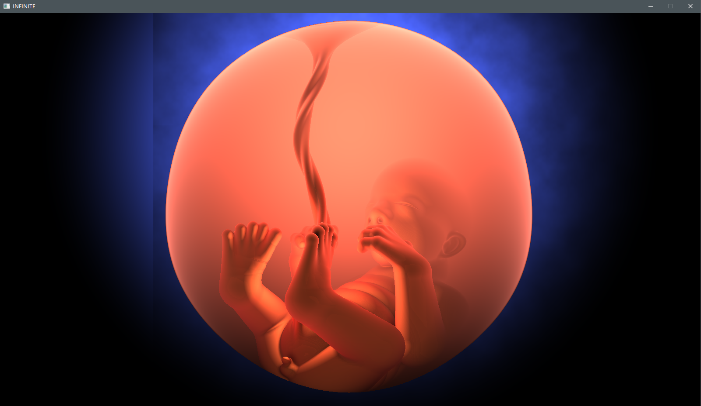
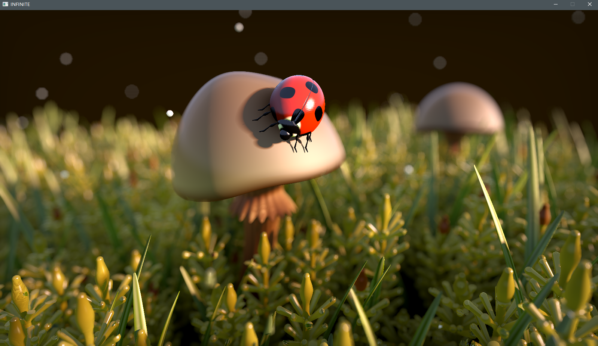

## 简介

 一个仿`shadertoy`的基于`OpenGL`的`Windows`本地渲染器，兼容`shadertoy`语法规则。

目前支持的Shader Input：

* iTime
* iTimeDelta
* iAudioDuration
* iFrame
* iChannelResolution[4]
* iResolution
* iDate
* iMouse
* iChannel[4]


### 配置文件示例

```
{
  "pass": [
    {
      "id": 0,
      "type": "image",
      "shaderPath": "res\\shaders\\custom\\TinyCloud\\Image.glsl",
	  "channels": [
		{
        	"type": "texture", 
        	"value": "res\\textures\\grayWhiteNoise01.bmp", 
        	"filterMode": "linear", 
        	"wrapMode": "repeat", 
        	"format": "r"
        }
	  ]
    }
  ]
}
```


### Demo 

[BabyToy](./sproject/INFINITE/res/shaders/custom/BabyToy)



[Ladybug](./sproject/INFINITE/res/shaders/custom/Ladybug)



[Mario](./sproject/INFINITE/res/shaders/custom/Mario)


[MusicVisualization](./sproject/INFINITE/res/shaders/mini-project/touhouMusic-Flandre)

